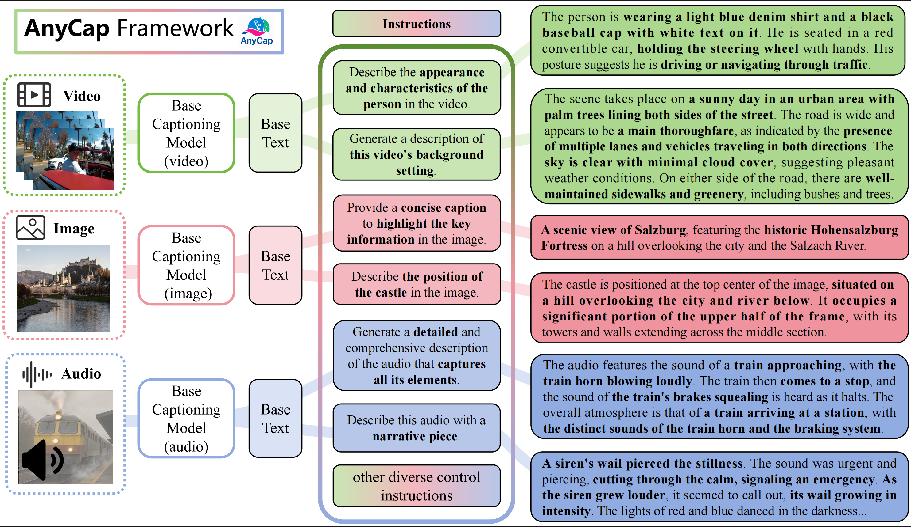

<!-- # AnyCap: A Unified Framework for Controllable Caption Generation

## Overview

AnyCap is a unified framework for controllable caption generation across different modalities including text, images, and videos. It provides tools for caption generation, model training, evaluation, and fine-tuning. The framework integrates advanced multimodal capabilities with a flexible pipeline, enabling high-quality and customizable captions for a wide variety of input data types.

This repository provides the necessary code for training and evaluating the AnyCap framework, along with dataset pipelines and predefined models. It also offers a custom benchmark (AnyCapEval) to evaluate the model's performance on various multimodal tasks.

## Key Features

- **Multimodal Support**: Generate captions for images, videos, and audio.
- **Customizable Caption Styles**: Control caption styles through predefined instructions and models.
- **Benchmarks and Evaluation**: Evaluate model performance using AnyCapEval, a benchmark designed for multimodal captioning.
- **User-Friendly Pipeline**: Predefined datasets and pipelines for easy training and evaluation.

## Installation

### Requirements

To run AnyCap, please install the following dependencies:

```bash
pip install -r requirements.txt
```

You can generate this `requirements.txt` by running `pip freeze > requirements.txt` from your virtual environment.

### Cloning the Repository

Clone the repository to your local machine:

```bash
git clone https://github.com/qishisuren123/AnyCap.git
cd AnyCap
```

## Dataset Setup

We provide datasets and benchmarks for training and evaluating the AnyCap model. 

### AnyCapDataset (Training Data)

The training data (`AnyCapDataset`) covers three modalities (audio, image, and video). 

- The dataset pipeline and textual annotations are included in this repository.
- Video modality data (`video_data`) is hosted externally on Hugging Face (link coming soon). Please download and place the video files into the corresponding directory (`AnyCapDataset/anycapdataset_video/video_data`).

### AnyCapEval (Our Benchmark)

- The testing data for our custom benchmark (AnyCapEval) will also be available soon on Hugging Face (link coming soon).
- Users must download the data and place it into the corresponding directories before running evaluations.

### Other Benchmarks

We also provide code to evaluate using three external benchmarks (one for each modality), which require users to manually download their datasets and place them accordingly.

## Usage

### Benchmark 1: AnyCapEval (Custom Benchmark)

Here we illustrate the usage for video modality (audio and image modalities follow a similar structure).

1. **Generate Captions**:

```bash
python /path/to/AnyCapEval/gen/gen_xxx.py
```

This generates two files:

- `content.jsonl`
- `style.jsonl`

2. **Configure Generated Files**:

Edit the file `anycapeval_video.sh`, update paths:

```bash
OUTPUT_PATH_CONTENT=/path/to/generated/content.jsonl
OUTPUT_PATH_STYLE=/path/to/generated/style.jsonl
```

3. **Run Evaluation**:

Activate proxy and run:

```bash
bash anycapeval_video.sh
```

### Benchmark 2-4: Other Benchmarks (e.g., VidCapBench)

We illustrate usage with the video modality benchmark (image and audio modalities follow a similar approach).

1. **Generate Captions**:

```bash
python /path/to/vidcapbench/gen/gen_xxx.py
```

2. **Run Evaluation**:

Set the generated `.jsonl` file in the `--caption_path` parameter:

```bash
python eval_xxx.py --caption_path /path/to/generated/captions.jsonl
```

**Note**: Remember to activate your proxy before running the evaluation scripts.

## Contributing

We welcome contributions to AnyCap! Please feel free to fork the repository, submit issues, or open pull requests.

### Guidelines

- Ensure your code is well-documented.
- Write tests for new features and fixes.
- Follow the style of the existing codebase.

## Citation

If you use AnyCap in your research, please cite our paper:

```bibtex
@misc{anycap2025,
  author = {Your Name},
  title = {AnyCap: A Unified Framework for Controllable Caption Generation},
  year = {2025},
  howpublished = {\url{https://github.com/qishisuren123/AnyCap}},
}
```

## License
@builtin markdown language features
This project is licensed under the MIT License - see the [LICENSE](LICENSE) file for details.
 -->


# AnyCap Project: A Unified Framework, Dataset, and Benchmark for Controllable Omni-modal Captioning

<p align="center">
    
</p>

<p align="center">
    🤗 <a href="https://huggingface.co/qishisuren/AnyCapModel">Model Weights</a> &nbsp;|&nbsp; 📊 <a href="https://huggingface.co/datasets/qishisuren/AnyCapEval">AnyCapEval Benchmark</a> &nbsp;|&nbsp; 📝 <a href="https://arxiv.org/abs/你的arxiv编号">Paper</a> &nbsp;|&nbsp; 📚 <a href="https://github.com/qishisuren123/AnyCap">Code</a>
</p>

---

## 🚩 Highlights

- 🏆 **Unified Multi-modal Captioning:** One framework covers image, audio, and video captioning with controllable styles.
- 📝 **Customizable Caption Styles**: Control caption styles through predefined instructions and models.
- 📊 **Open Benchmark & Evaluation:** AnyCapEval—an industry-level, multi-modal benchmark with comprehensive evaluation protocols.
- 🛠️ **End-to-End Open Source:** Full training pipeline, evaluation toolkits, dataset pipeline and open benchmark.


---

## 📑 Todo List

- [x] Paper released
- [x] AnyCapEval benchmark available
- [x] Pretrained model weights released
- [ ] Training dataset (AnyCapDataset) to be open-sourced soon

---

## 🚀 Quick Start

### Installation

```bash
git clone https://github.com/qishisuren123/AnyCap.git
cd AnyCap
pip install -r requirements.txt
```

Install Fairseq manually:

```bash
git clone https://github.com/pytorch/fairseq
cd fairseq
pip install --editable ./
```

### Download Weights

- [AnyCapModel weights on HuggingFace](https://huggingface.co/qishisuren/AnyCapModel)

### Download Benchmark Data

- [AnyCapEval benchmark on HuggingFace](https://huggingface.co/datasets/qishisuren/AnyCapEval)
- Training dataset (**AnyCapDataset**) will be released soon.

---

## 💡 Introduction

**AnyCap** is a unified and controllable omni-modal captioning framework, supporting caption generation for images, audio, and videos with fine-grained style control. The framework is fully open-source, featuring training code, benchmark datasets, and a comprehensive evaluation toolkit—all-in-one.

*Figure 1 above shows an overview of the AnyCap architecture and data pipeline.*

---

## 📊 Benchmark & Evaluation

### AnyCapEval Benchmark
Here we illustrate the usage for video modality (audio and image modalities follow a similar structure).

1. **Generate Captions**:

```bash
python /path/to/AnyCapEval/gen/gen_xxx.py
```

This generates two files:

- `content.jsonl`
- `style.jsonl`

2. **Configure Generated Files**:

Edit the file `anycapeval_video.sh`, update paths:

```bash
OUTPUT_PATH_CONTENT=/path/to/generated/content.jsonl
OUTPUT_PATH_STYLE=/path/to/generated/style.jsonl
```

3. **Run Evaluation**:

Activate proxy and run:

```bash
bash anycapeval_video.sh
```

### Related Caption Benchmarks (e.g., VidCapBench)

We illustrate usage with the video modality benchmark--VidCapBench(image and audio modalities follow a similar approach).

1. **Generate Captions**:

```bash
python /path/to/vidcapbench/gen/gen_xxx.py
```

2. **Run Evaluation**:

Set the generated `.jsonl` file in the `--caption_path` parameter:

```bash
python eval_xxx.py --caption_path /path/to/generated/captions.jsonl
```


## 📂 Dataset

### AnyCapDataset (Coming Soon)

High-quality, fully annotated datasets for all three modalities (image, audio, video) will be released soon on HuggingFace. Stay tuned!

---

## 🤝 Contributing

We welcome contributions! Please open issues or submit PRs for feedback and improvements.

---

## 📝 Citation

```bibtex
@misc{anycap2025,
  author = {Your Name},
  title = {AnyCap: A Unified Framework for Controllable Caption Generation},
  year = {2025},
  howpublished = {\url{https://github.com/qishisuren123/AnyCap}},
}
```

---

## License

This project is licensed under the MIT License – see the [LICENSE](LICENSE) file for details.
